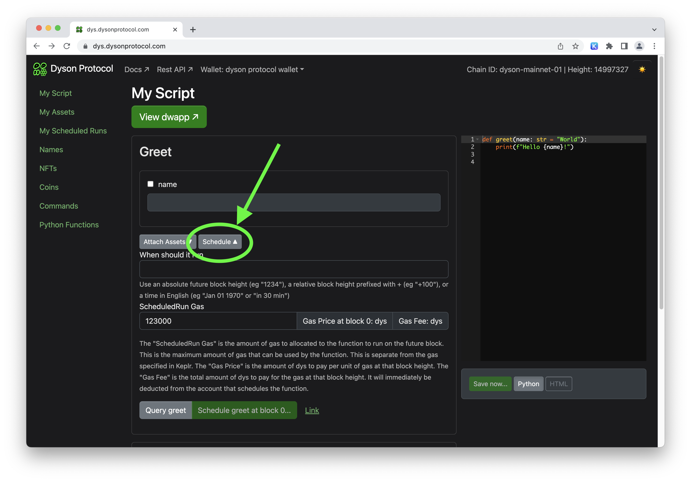

Dyson Protocol v0.3.0: A Leap Forward in Dwapps Development
=========================================================

The Dyson Protocol is back with a bang! In its new 0.3.0 version, it brings powerful features and huge improvements that further advance the capabilities of decentralized web app development.

The Future is Scheduled
-----------------------



With v0.3.0, scheduled runs can now be registered up to a whopping 5,000,000 blocks (about 2 months) in the future. This is a considerable improvement from the previous limit of approximately 1 hour. This means that developers can now schedule their applications to perform tasks much farther into the future.

Names: More Control, Longer Durations
-------------------------------------


Names registration now lasts for 31,536,000 blocks (roughly 1 year) at the cost of 1%. You also get the added advantage of auto-renewal of names at the expiration height. No more worrying about your registration expiring!

NFTs Take Center Stage
----------------------


The new upgrade introduces support for NFTs. If you own a name, for instance 'example.dys', you can now create unlimited NFT Classes (collections) under that name or its subnames like 'foo.example.dys' or 'bar.example.dys'. The possibilities are endless!


Interchain Accounts Integration
-------------------------------

:::info Read More on ICA

[Cosmos IBC Interchain Accounts](https://ibc.cosmos.network/main/apps/interchain-accounts/overview.html) 

:::

The addition of Interchain Accounts is an exciting development. With these, you can register and control addresses on other chains using scripts. It gets better when you combine this with the ScheduledRuns feature -- you can perform actions like transferring funds between chains or sending arbitrary transactions, all within a script!

A Streamlined UI Experience
---------------------------


The user interface (UI) has also received a major facelift. The script code editor is now resizable, and you can schedule functions directly from the function form. The new UI also includes a detailed view of names with related coin denominations and NFC Classes, forms for minting coins and NFTs, and an improved asset page.

Eventful Scripts and Subscriptions
------------------------------------

```python
from dys import emit_event

def greet(name: str = "World"):
    emit_event(key="name", value=name)
```
In v0.3.0, you can emit custom events from scripts and subscribe to them via websockets. This opens the way for real time updates and better transaciton indexing.


In Conclusion
-------------

Dyson Protocol v0.3.0 is here to transform your dApp development experience. With significant enhancements and new features like extended ScheduledRuns, NFT Classes, Interchain Accounts, and an improved UI, this update is poised to take your decentralized applications to new heights. Stay tuned for more exciting updates from Dyson Protocol!
