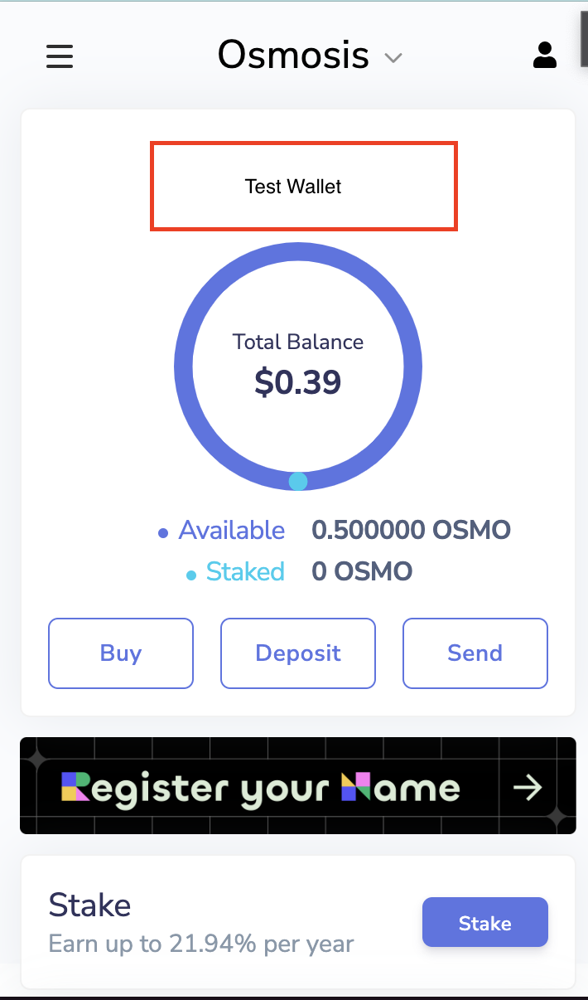
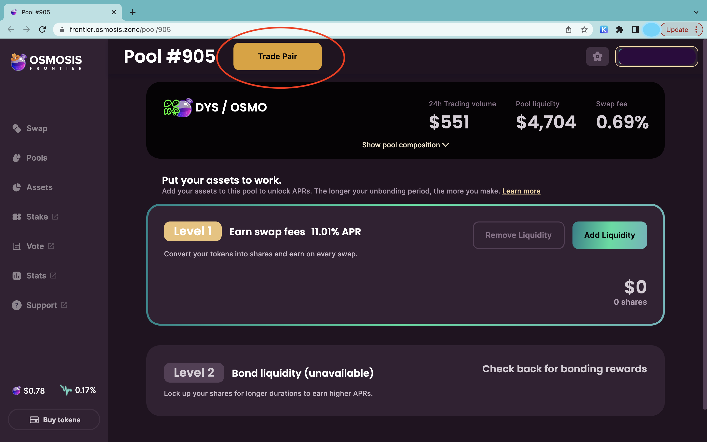
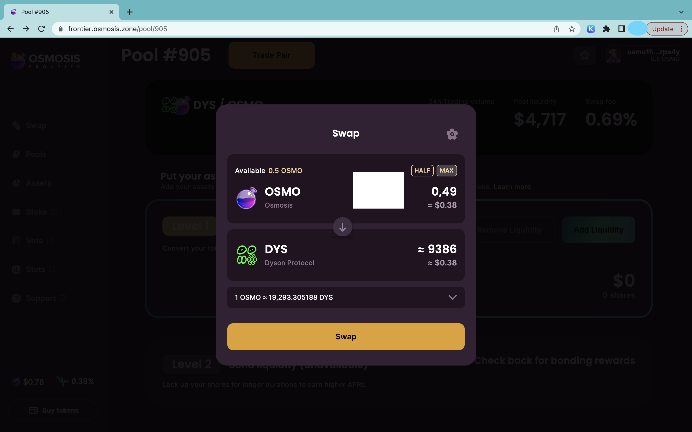
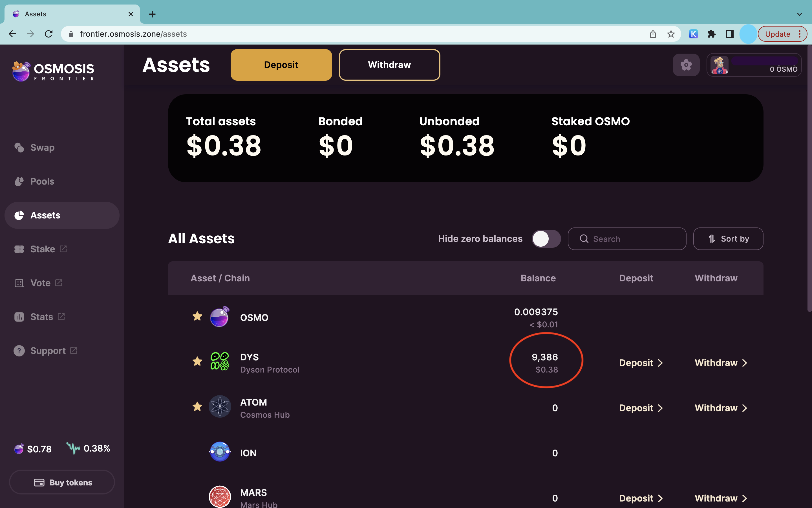

## How to Buy DYS: A Step-by-Step Guide to Getting Started with the Dyson Protocol

**Introduction**

Are you excited about diving into the world of Decentralized Web Apps (DWapps) using the Dyson Protocol? To get started, you'll need to acquire some DYS coins. This step-by-step guide will show you how to buy DYS using Osmosis (OSMO) on the Osmosis Frontier.

**Step 1: Prepare your Keplr Wallet**

Before you can buy DYS, you'll need to have Osmosis (OSMO) in your Keplr Wallet. If you don't have a Keplr Wallet yet, visit https://www.keplr.app/ to create one.

**Step 2: Buy Osmosis (OSMO)**

If you don't already have Osmosis (OSMO) in your Keplr Wallet, you'll need to buy some first. You can do this on a cryptocurrency exchange that supports these tokens, such as Thor Chain, Binance, or Kraken. After purchasing the coins, transfer them to your Keplr Wallet.

**Step 3: Access the DYS/OSMO pool on Osmosis Frontier**

Navigate to the Osmosis Frontier by visiting the following URL: https://frontier.osmosis.zone/pool/905. This is where you can swap your Osmosis (OSMO) for DYS coins.

**Step 4: Trade your tokens for DYS**

Click on the "Trade Pair" button on the Osmosis Frontier page. This will open a new window where you can swap your Osmosis (OSMO) for DYS coins.

**Step 5: Execute the swap**

Enter the amount of Osmosis (OSMO) you want to swap for DYS. Review the transaction details, including the exchange rate and any fees. Once you're satisfied, confirm the transaction to complete the swap. We suggest using the lowest fees.

**Step 6: Congratulations, you now own DYS coins!**

You've successfully swapped your Osmosis (OSMO) for DYS coins on the Osmosis Frontier. The DYS coins will now be available to withdrawal to the Dyson blockchain via your Keplr Wallet.

**Step 7: Withdraw your DYS to your wallet (optional)**

For added security, it is recommended that you withdraw your DYS coins from the Osmosis Frontier to the Dyson Blockchain via your Keplr Wallet. To do this, use the "withdrawal" button or follow the instructions provided by the Keplr Wallet interface. For further details you can also visit: https://docs.osmosis.zone/overview/getting-started

**Conclusion**

With your newly-acquired DYS coins, you're now ready to start exploring and building Decentralized Web Apps using the Dyson Protocol. Happy Coding!

