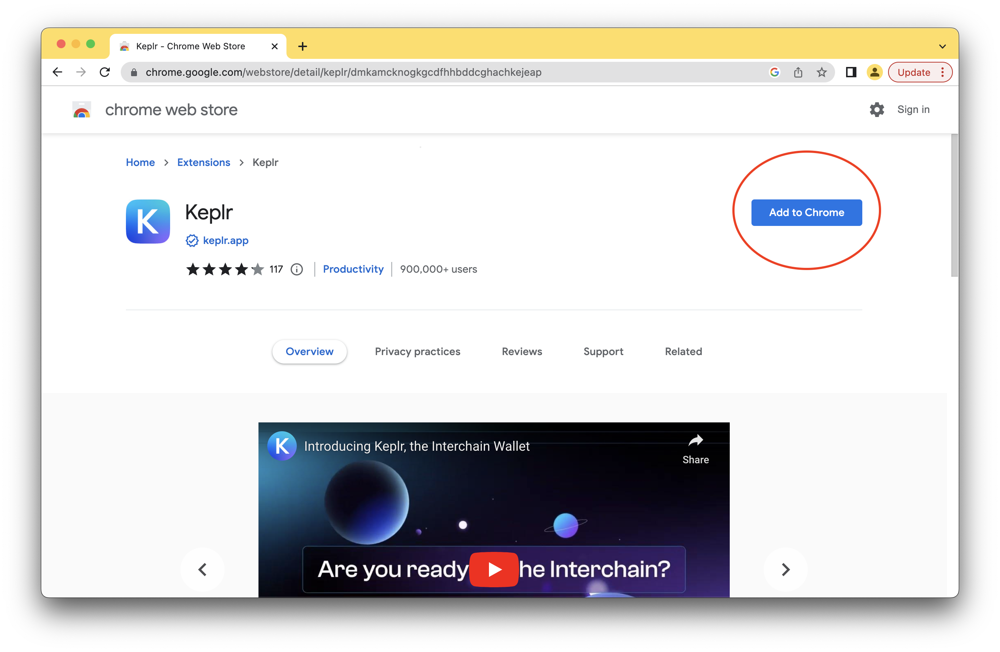
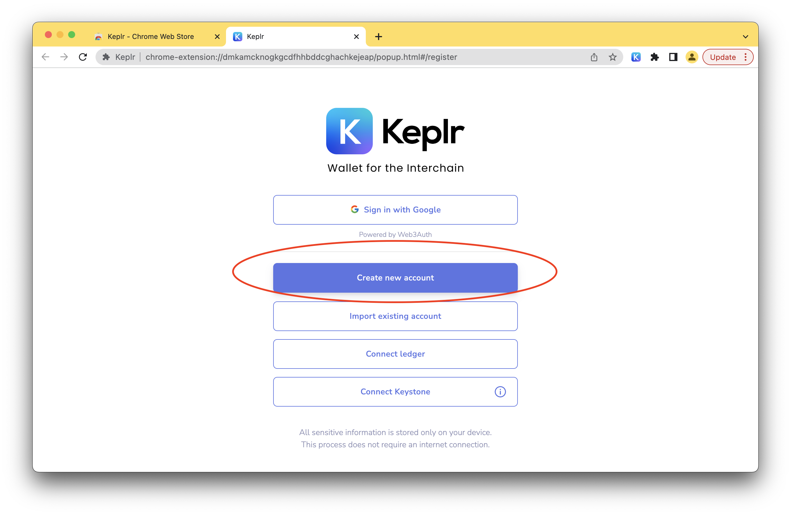
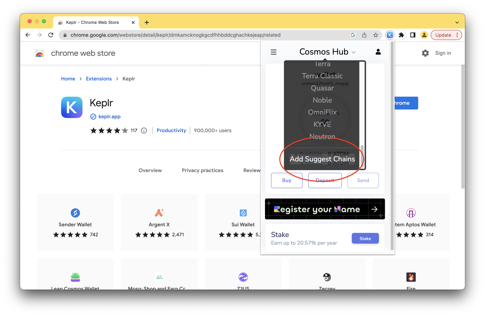
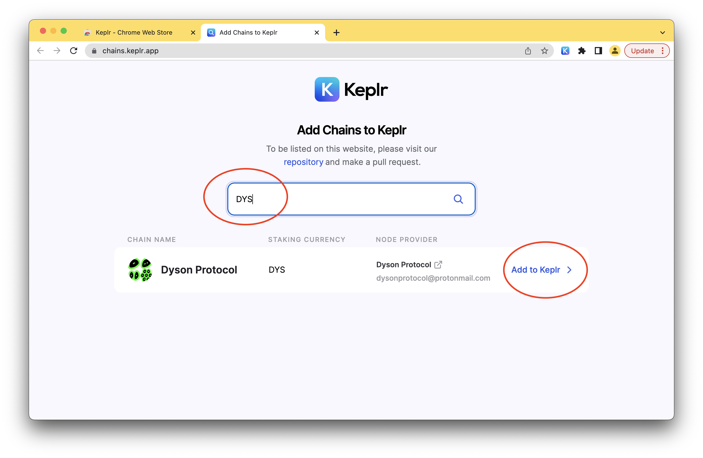
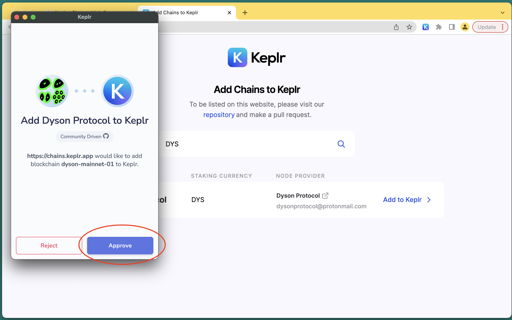

title: How To Use the Keplr Wallet & get Testnet DYS
description: How To Use the Keplr Wallet & get Testnet DYS

## Would you like to receive some testnet DYS tokens & start building DWapps on the testnet?

It only takes a few minutes to get setup. Here’s a quick step by step:

1. Install the Keplr wallet for Chrome. (There are other wallets but this is the easiest to get started with)

2. Create an account.
IMPORTANT: Save your seed somewhere SAVE and NEVER share it with anyone ever!

3. Add Dyson Protocol as one of the suggested Chains

4. Approve it!

7. Join the Dyson Protocol Discord.

8. Copy your new DYS address into the channel #testnet-faucet and you will be receiving DYS into your Keplr wallet

Your testnet coins should now show up in your Keplr wallet. If you have any questions, use the #help-me channel in Discor

