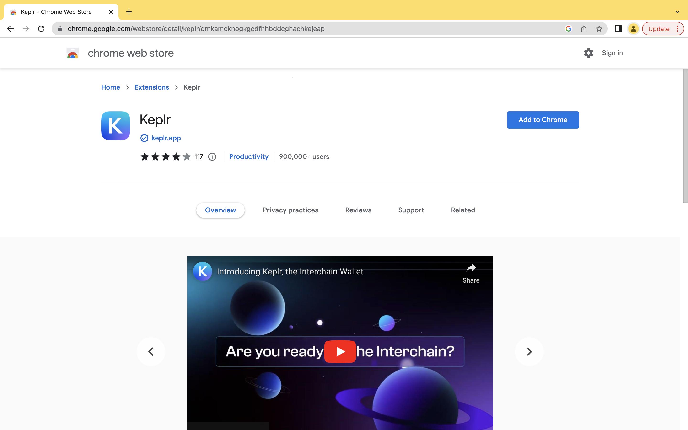
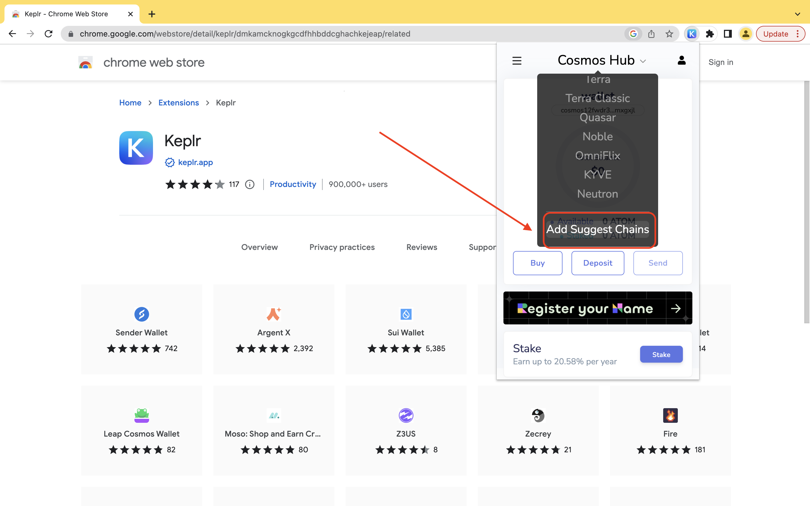
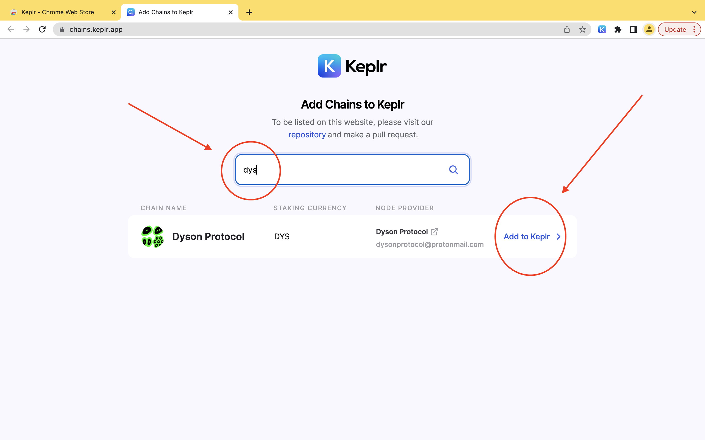
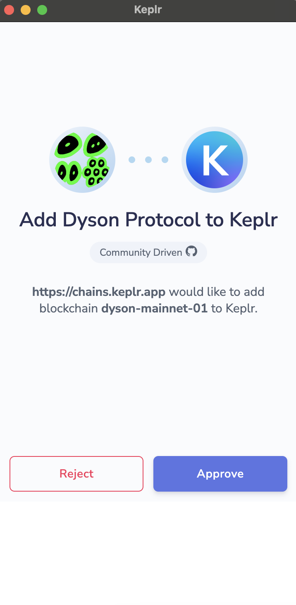

### Would you like to receive some testnet DYS tokens to start building DWapps on the testnet?

It only takes a few minutes to get setup. Here’s a quick step by step:

1. Install the Keplr wallet for Chrome. (There are other wallets but this is the easiest to get started with)

2. Create an account.
IMPORTANT: save your seed somewhere save and NEVER share it with anyone ever!

3. Add Dyson Protocol as one of the suggested Chains

4. Navigate your Chrome browser to https://dys.dysonvalidator.com/

5. In the top right, click “Connect with Keplr”

6. Approve the connection the the Dyson Chain

7. Join the Dyson Protocol Discord.

8. Copy your new DYS address into the channel #testnet-faucet and you will be receiving DYS into your Keplr wallet

We hope to see you in the Discord!

