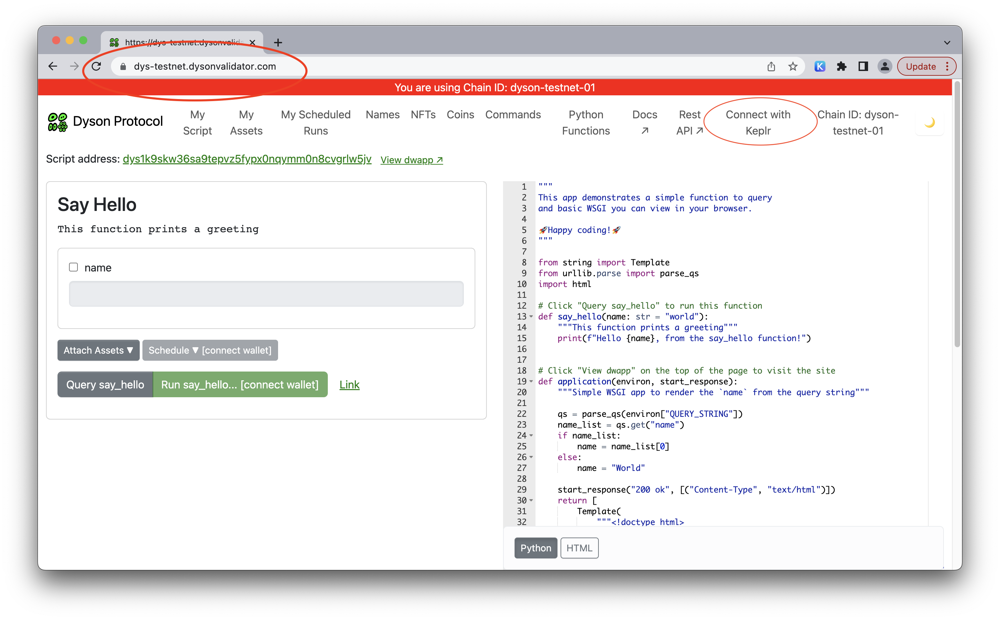

Setting up the Keplr Wallet for DYS allows you to receive free testnet DYS tokens, enabling you to explore the interface and test interactions with the chain. This guide provides a quick step-by-step process for setting up the Keplr Wallet and joining the Dyson Protocol Discord community.

**Step 1: Install the Keplr Wallet for Chrome**

Begin by installing the Keplr wallet extension for Chrome. This wallet is recommended for its user-friendly interface and ease of use.

**Step 2: Create an Account and Safeguard Your Seed Phrase**
After installing Keplr, create a new account within the wallet. It is crucial to save your seed phrase SECURELY and NEVER share it with anyone.

**Step 3: Access the Dyson Protocol Website**

Navigate your Chrome browser to https://dys.dysonvalidator.com/.

**Step 4: Connect Keplr Wallet to Dyson Protocol**

On the Dyson Protocol website, locate the "Connect with Keplr" button in the top right corner and click it to connect.

**Step 5: Accept the Connection to the Dyson Chain**

Once you've selected "Use Keplr," the connection to the Dyson Chain will be established. Follow the prompts in the Keplr wallet to approve the connection.

**Step 6: Join the Dyson Protocol Discord**

To engage with the Dyson Protocol community, join the official Dyson Protocol Discord server https://discord.gg/BNHRHGdeNj . This platform allows for discussions, support, and staying up-to-date with the latest project developments.

By following these simple steps, you can set up your Keplr wallet, receive free testnet DYS tokens, and join the Dyson Protocol Discord community. Enjoy exploring the interface and testing interactions with the chain.r

