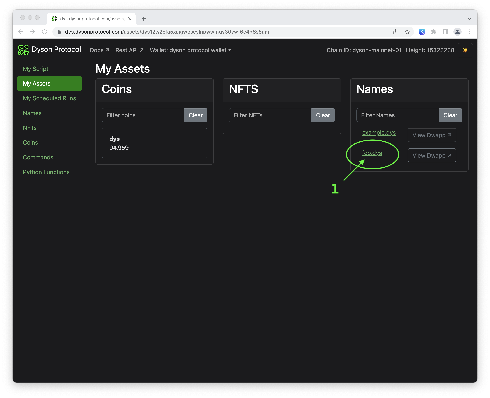
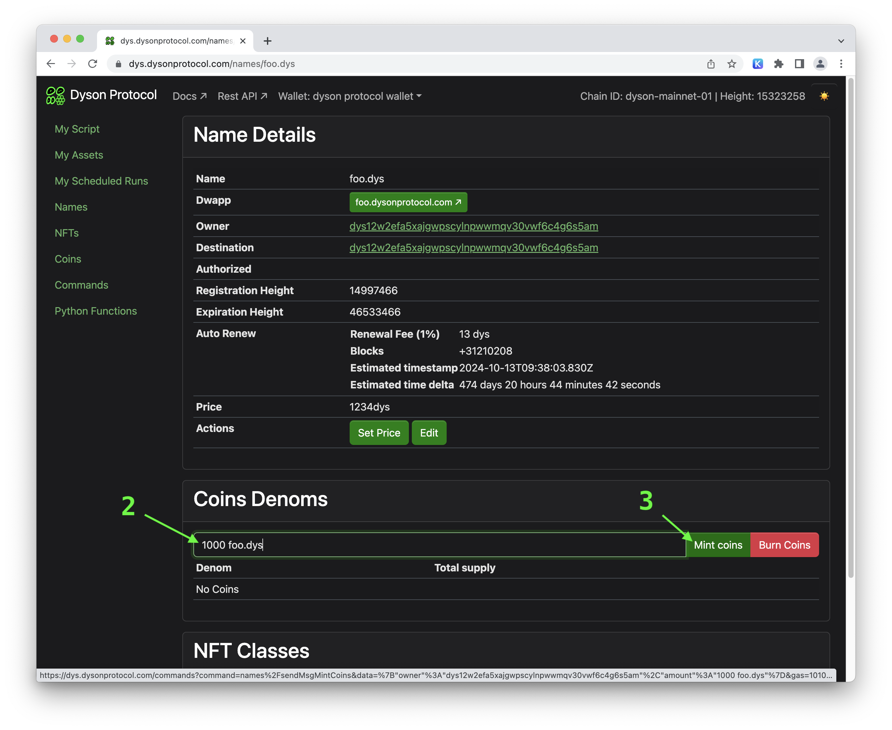
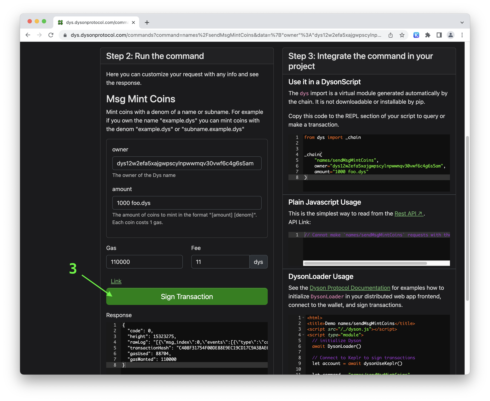
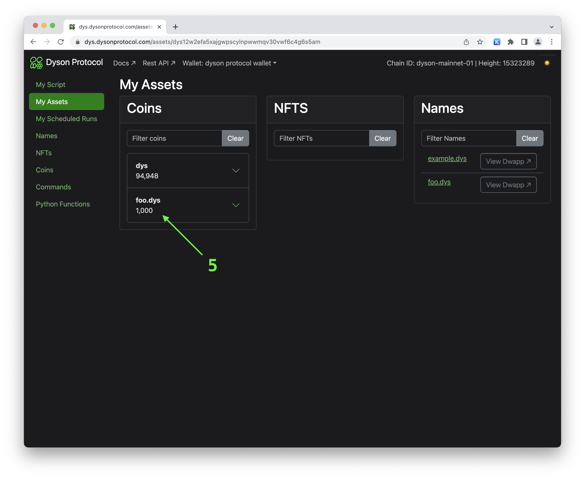

# How to Mint Coins on Dyson Protocol

Minting coins is a crucial part of the cryptocurrency experience. On Dyson Protocol, the process is simplified and designed to be user-friendly. In this guide, we'll walk you through each step of the process to mint your own coins.

## Understanding Dys Names

:::info
See the page [Dys Names](/names) for background and technical details.
:::

Before we start, it's important to understand what Dys Names are. These are unique identifiers for assets within the Dyson Protocol. Refer to the link above for detailed information.

:::warning What about Keplr Wallet
All assets on Dyson Protocol are automatically available from the "My Assets" page. If you want your coin to appear in Keplr, consider submitting a GitHub pull request to the [Keplr Chain Registry](https://github.com/chainapsis/keplr-chain-registry/blob/main/cosmos/dyson-mainnet.json#L24)
:::

## Step-by-Step Guide to Minting Coins

Follow these steps to mint your own coins:

### Step 1: Choose your name

Go to "My Assets" and click on the name you want to mint coins for. In this guide, we'll be minting some "foo.dys" coins.

### Step 2: Coin Details

Enter the amount and denom of the coins you want to mint. In our example, we will mint "1000 foo.dys" coins. Then, click "mint coins" to proceed to the Commands page with data prefilled.

### Step 3: Sign the Transaction

Sign the transaction to mint your coins. Note the cost to mint coins – each coin costs 1 gas (0.0001 dys at today's price), so minting 1000 coins will cost 1 dys. Additionally, there is a base cost of 10 dys to mint coins.

:::info
How much does it cost to mint coins? Every coin costs 1 gas (0.0001 dys at today's price), so minting 1000 coins will cost 1 dys. Additionally, there is the base cost of 10 dys to mint coins.
:::

### Step 4: Verify Your Coins

Go back to "My Assets" to see the new coins you just minted!

Congratulations! You've successfully minted your own coins on the Dyson Protocol. You can now send them to anyone or use them as you see fit. Enjoy your journey into the world of cryptocurrencies!
