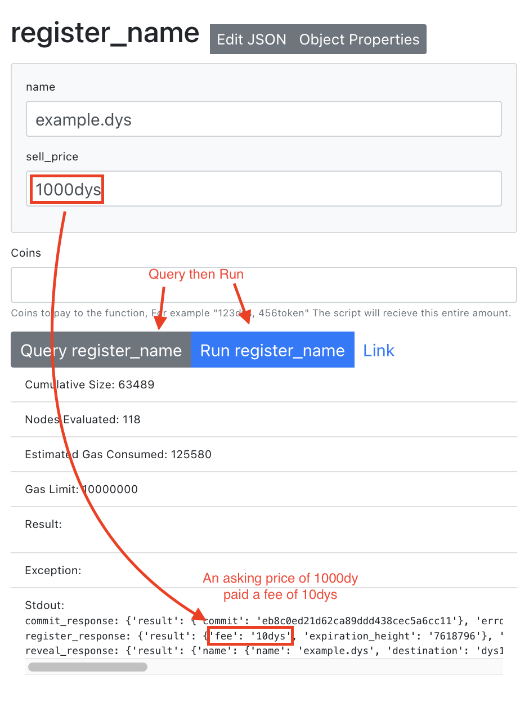

# How to Register Dys Names

## What are Names?

See the page [Dys Names](/names) for background and technical details.

## Copy this code

There is no UI for registering a name yet. So you will need a little programming experience.
If you have never programmed, you may get frustrated because it looks complex, but don't give up, just ask for help in Discord.

Copy this code to your Script and save it.

```python showLineNumbers
from dys import _chain, SCRIPT_ADDRESS, get_caller


def _register_commit(name: str, price: str, salt: str):
    """
    Step 1 in the Commit/Reveal process
    """
    # ensure the "price" is denominated in "dys"
    if not price.endswith("dys"):
        price += "dys"

    # This is a helper query as a refrence hash implementation.
    # To be secure, the commit hash should be generated off-line and the name
    # kept private until the reveal step.
    commit_response = _chain(
        "names/QueryGenerateCommit", owner=SCRIPT_ADDRESS, name=name, salt=salt
    )
    print(f"commit_response: {commit_response}")
    assert not commit_response["error"], commit_response["error"]

    register_response = _chain(
        "names/sendMsgRegister",
        commit=commit_response["result"]["commit"],
        owner=SCRIPT_ADDRESS,
        price=price,
    )
    print(f"register_response: {register_response}")
    assert not register_response["error"], register_response["error"]


def _reveal_commit(name: str, salt: str):
    """
    Step 2 in the Commit/Reveal process

    """

    reveal_response = _chain(
        "names/sendMsgReveal", name=name, owner=SCRIPT_ADDRESS, salt=salt
    )
    print(f"reveal_response: {reveal_response}")
    assert not reveal_response["error"], reveal_response["error"]


# this can be a public function as it only has read only commands
def query_name(name: str):
    return _chain("names/QueryName", name=name)


def register_name(name: str, price: str):
    """Register you name and set the buy price"""
    assert get_caller() == SCRIPT_ADDRESS, f"forbidden, you are not {SCRIPT_ADDRESS}"
    # This should be randomly generated off-chain
    salt = "12341234"

    # this is a demo of the "commit reveal" pattern.
    # In practice, generating the commit hash
    # should be done offline to prevent front-running.
    _register_commit(name, price, salt)

    # Now reveal that we knew the name and salt that made the commit
    _reveal_commit(name, salt)


def app(environ, start_response):
    start_response("200 ok", [("Content-type", "text/plain")])
    return [f"Hello from Dyson Protocol! {SCRIPT_ADDRESS}".encode()]

```

## Run the "Register name" function

:::tip

You should always "Query" a function before "Running" it. You will get the estimated amount of gas that is used and see any errors in the response.

**You will save a lot of time and gas by testing functions with "Query" first.**

:::

:::info Out of Gas

If you get the error `MemoryError('Out of Gas')`, you can either simply run the function again and it will automatically adjust the gas used. Or you can manually increase the gas in Keplr when signing.

:::


