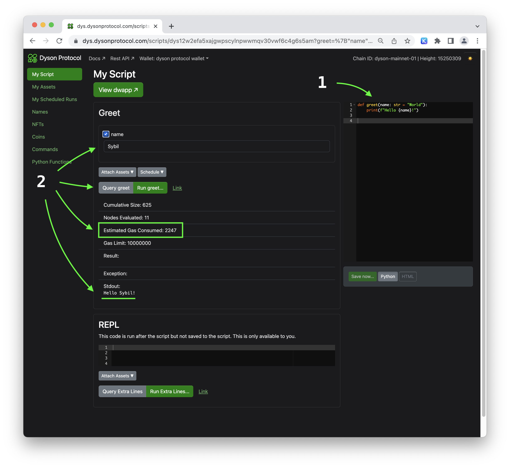
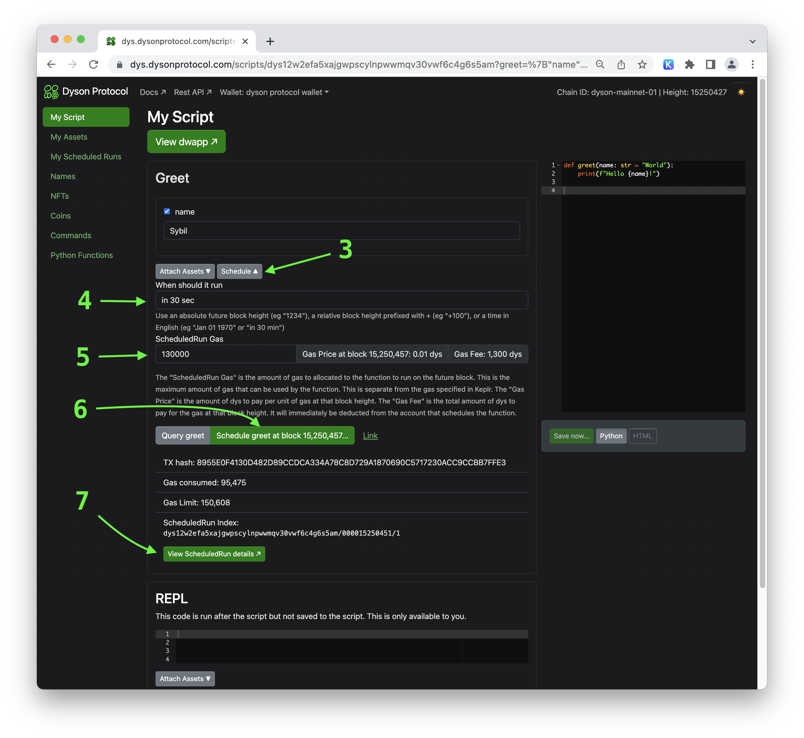
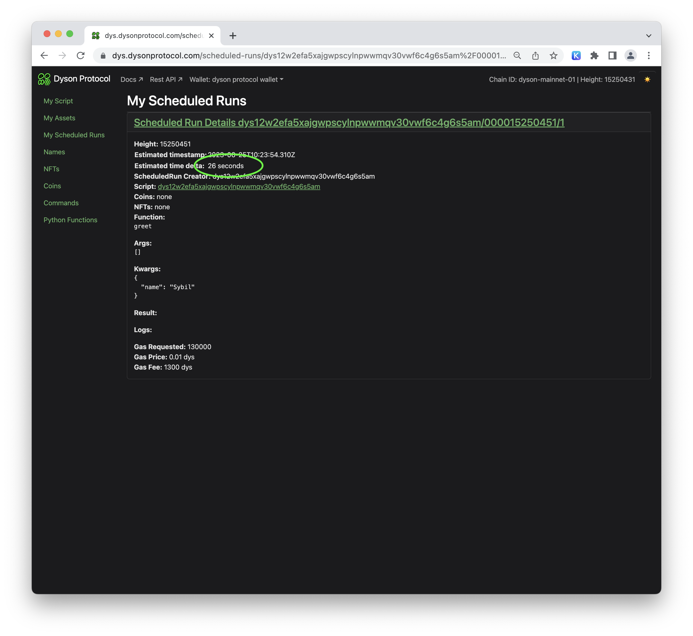
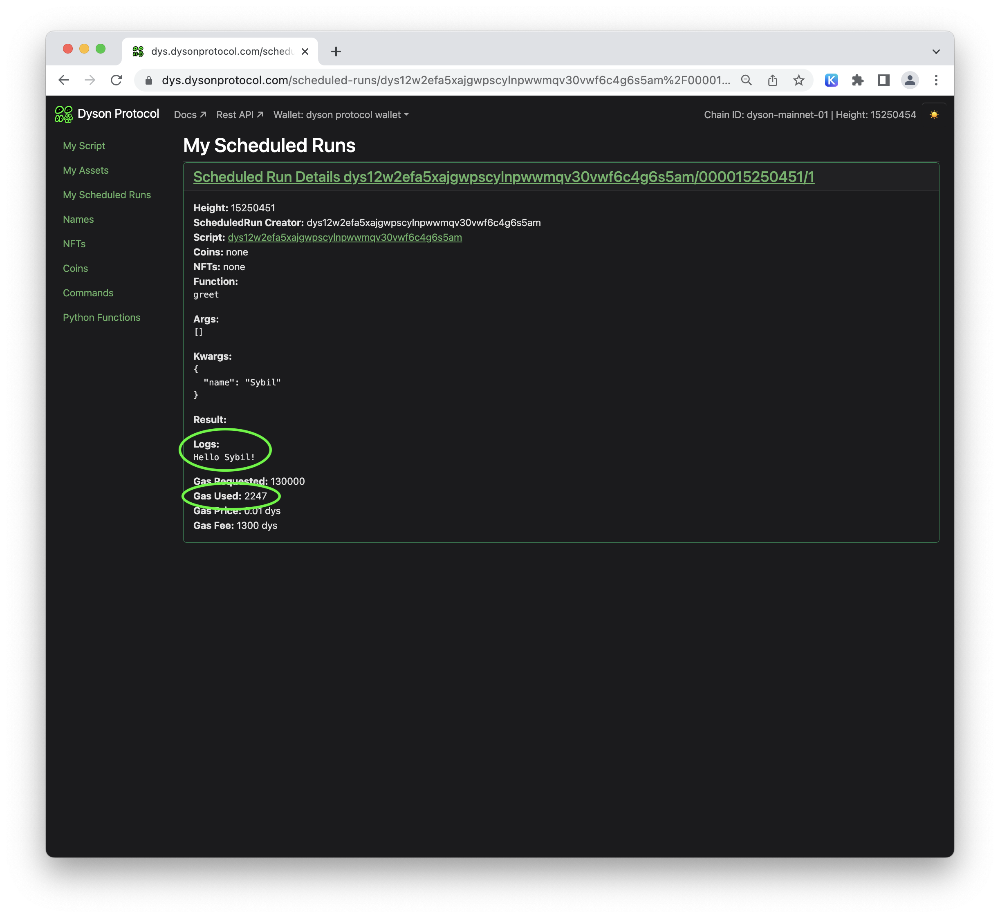

The Dyson Protocol empowers developers by providing an innovative feature: scheduling functions to run at a future block. Here's a step-by-step guide on how to use this feature:

1. **Write your function**: The first step is to define the operation you want to execute at a specific block height in the future.

2. **Query the function to estimate the gas price**: This will give you a rough idea of how much gas your function might need.

    

3. **Click 'Schedule'**: You'll find this option in the Dyson Protocol interface.

4. **Set the block or time for the function to run**: You can specify an absolute block, a relative block delta, or an absolute or relative time.

5. **Specify the amount of gas your function will need**: Use the estimated gas price obtained earlier, and add a safe margin.

6. **Click 'Schedule [function name]' and sign the transactions**: This will set your function to run at the specified block.

7. **Wait for the transaction confirmation**: Once successful, there will be a link to the results.

    

8. **Review the results and logs after the function has run**: These details will be updated automatically once the function has executed.

    

    

With these steps, you can effectively schedule your functions to run at a future block using the Dyson Protocol. Happy coding!

