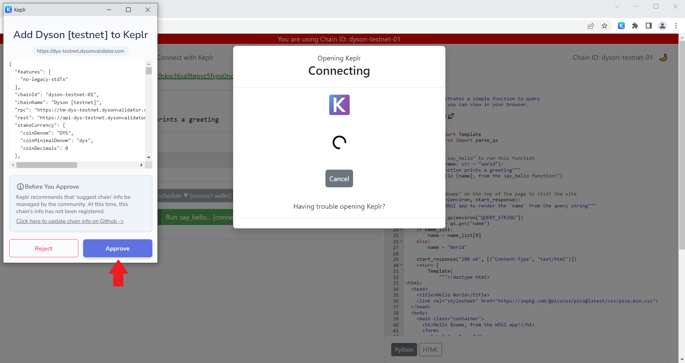
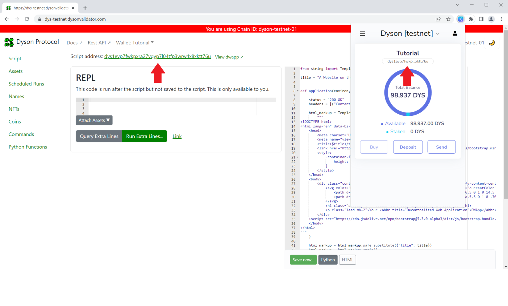
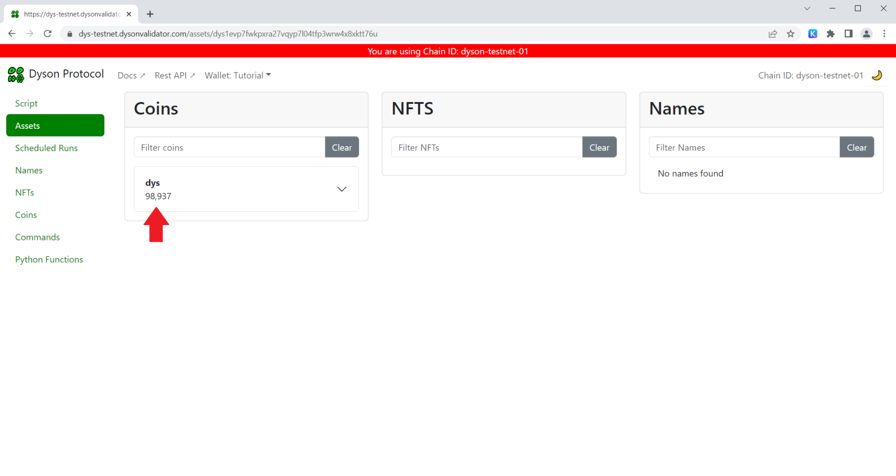
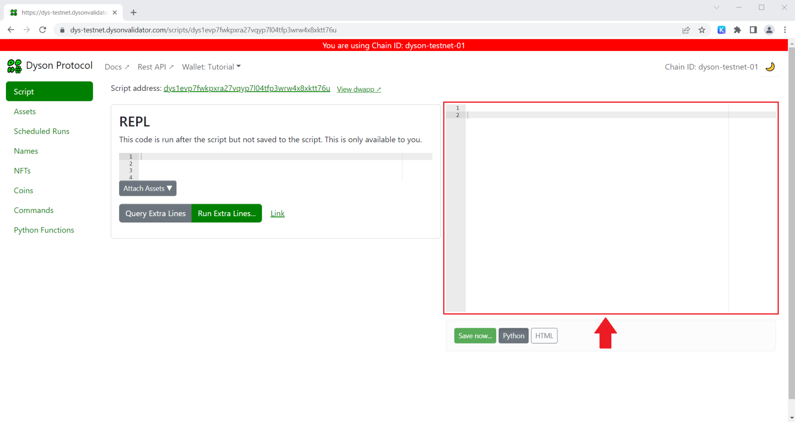
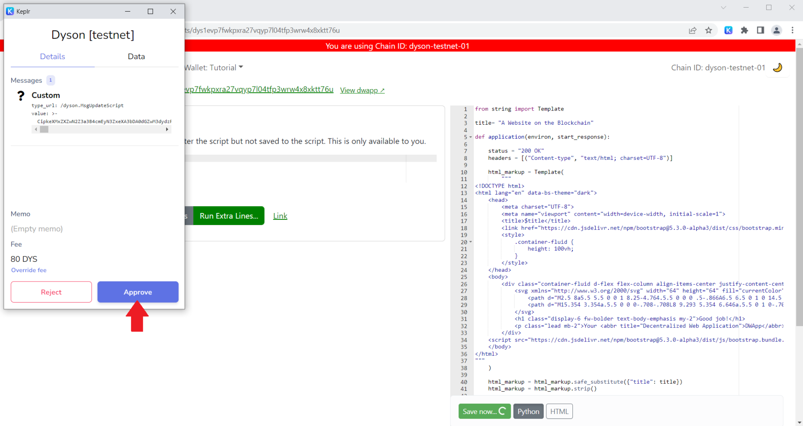
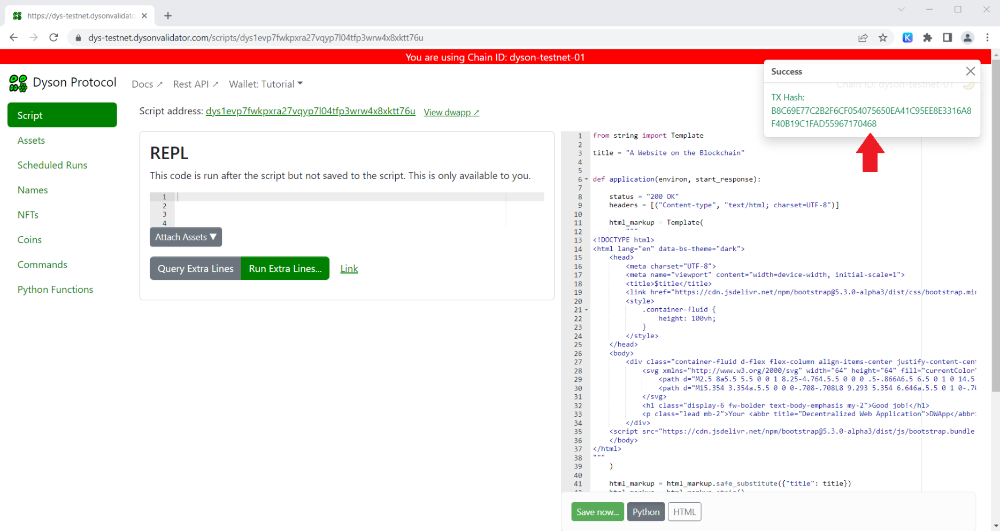
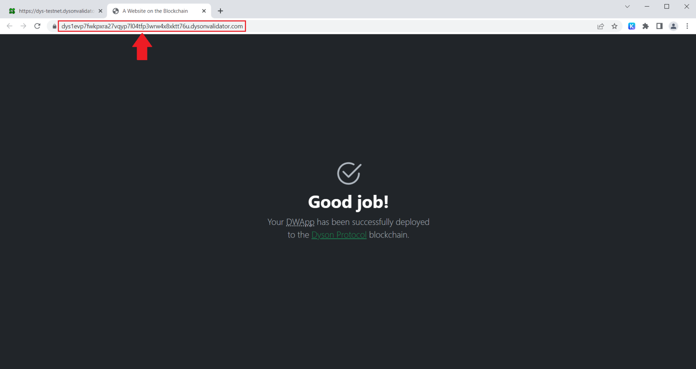

# A Website on the Blockchain

"*Web3*" - and its lesser-known counterpart, "*Web5*" (that's `Web 2.0 + Web3` *for those playing along*) - is a vision of the next generation of the internet that emphasizes decentralization and user control. This model combines blockchain technology, decentralized protocols, and smart contracts to create a more transparent, open, and user-centric digital environment.

One key player in this vision is **The Dyson Protocol** blockchain. It empowers all people - users, creators, and developers alike - to engage and contribute to this rapidly evolving ecosystem. It does this by offering an *intuitive* and *familiar* alternative to the complex development environments and programming paradigms associated with most other blockchain platforms.

Let's dive right in, and I'll show you what this means in practice.

> You don't *need* to be a developer to follow this tutorial. Anyone is welcome to give it a try! 👍

## Prerequisites

For this tutorial, I'm going to assume you have the **Keplr** browser-extension installed and you know how to use it. That's pretty much all you will need.

> If that's **not** the case, *and you still want to follow along*, check out this [useful guide](https://docs.dysonprotocol.com/tutorials/HowToUsetheKeplrWalletandgetyourtestnetDYS/) on the Dyson Protocol Docs page. It will help you set up Keplr. Once you're done, come back here and continue. 😎

## Let's Go!

### The Dashboard

Begin by navigating to the Dyson Protocol testnet [Dashboard](https://dys-testnet.dysonvalidator.com/) and click `Connect with Keplr` at the top of the page.

If this is your first visit, you'll be prompted to add the testnet to Keplr. `Approve` this.



> This step allows the Keplr extension to interact with the Dyson Protocol blockchain.

### Obtaining Tokens

Next, you'll need some **DYS** tokens. DYS is the native utility and governance token of the Dyson Protocol. Since we're using the Dyson Protocol testnet, we'll use *testnet DYS* instead. 

> These tokens have no value, making them perfect for testing!

To acquire them, go to the [testnet faucet](#), enter your DYS wallet address, et voila, you're done!

> You can find your DYS address at the top of the Dashboard page. Alternatively, switch to **Dyson [ testnet ]** in your Keplr extension, and you should be able to copy it from there.



### Checking Your Assets

To confirm that you've received your tokens, return to the Dashboard page and click `My Assets` in the main menu.



### Your "User Script"

Now, click `My Script` to return to the previous page. It should look something like this:



That large text box on the right is your **user script**. It's automatically linked to your DYS address and can only be modified by your wallet, i.e. *you*. It's empty right now, so let's do something about that.

## Creating Your First DWApp

Below is a simple example of a user script. `Copy` and `paste` it into your user script area.

```python
from string import Template

title= "A Website on the Blockchain"

def application(environ, start_response):

    status = "200 OK"
    headers = [("Content-type", "text/html; charset=UTF-8")]

    html_markup = Template(
        """
<!DOCTYPE html>
<html lang="en" data-bs-theme="dark">
    <head>
        <meta charset="UTF-8">
        <meta name="viewport" content="width=device-width, initial-scale=1">
        <title>$title</title>
        <link href="https://cdn.jsdelivr.net/npm/bootstrap@5.3.0-alpha3/dist/css/bootstrap.min.css" rel="stylesheet">
		<style>
            .container-fluid {
                height: 100vh;
            }
		</style>
	</head>
    <body>
        <div class="container-fluid d-flex flex-column align-items-center justify-content-center text-center">
            <svg xmlns="http://www.w3.org/2000/svg" width="64" height="64" fill="currentColor" viewBox="0 0 16 16">
                <path d="M2.5 8a5.5 5.5 0 0 1 8.25-4.764.5.5 0 0 0 .5-.866A6.5 6.5 0 1 0 14.5 8a.5.5 0 0 0-1 0 5.5 5.5 0 1 1-11 0z"/>
                <path d="M15.354 3.354a.5.5 0 0 0-.708-.708L8 9.293 5.354 6.646a.5.5 0 1 0-.708.708l3 3a.5.5 0 0 0 .708 0l7-7z"/>
            </svg>
            <h1 class="display-6 fw-bolder text-body-emphasis my-2">Good job!</h1>
            <p class="lead mb-2">Your <abbr title="Decentralized Web Application">DWApp</abbr> has been successfully deployed<br /> to the <a class="link-success" href="https://dysonprotocol.com/">Dyson Protocol</a> blockchain.</p>
        </div>
	<script src="https://cdn.jsdelivr.net/npm/bootstrap@5.3.0-alpha3/dist/js/bootstrap.bundle.min.js"></script>
    </body>
</html>
"""
    )

    html_markup = html_markup.safe_substitute({"title": title})
    html_markup = html_markup.strip()

    start_response(status, headers)

    return [bytes(html_markup, "UTF-8")]
```

### Deploy It

Click the `Save Now` button below the script. This action will initialize a transaction via Keplr. `Approve` this.



Wait for confirmation on the Dashboard.



Next, click the `View DWApp` link at the top of page. Your app should open in a new browser window, displaying a unique URL that includes your DYS address.



### Success!

Congratulations! You've just set up a DWapp development environment, entered a user script, and deployed it directly on-chain. There were no complex languages involved, and the development environment was very easy to use and understand. Isn't that cool? 😎

## Developer Details

Developers might have noticed that the script appears to be written in Python. *The button labelled "Python" may have also tipped you off* 😉. However, it's actually written in a *simplified subset* of Python called **Dyslang**.

Dyslang web applications are able utilize the Web Server Gateway Interface (WSGI) standard - as demonstrated in the `application` function above - to handle HTTP requests and responses, outputting various content types such as HTML, CSS, JS, JSON, and SVG over HTTP.

When deployed, scripts are automatically compiled down to the Python Abstract Syntax Tree (AST). Then, each node is checked against a whitelist of approved operations before being stored on-chain.

> This process helps address many of the security concerns associated with using Python in a blockchain environment.

Let's walk through the script and see what it's actually doing.

### Import Libraries

We begin by importing the `Template` class from the Python `string` module. This class provides a way to substitute placeholders in a string with actual values.

```python
from string import Template
```

### Defining A Variable

Next, a `title` variable is defined with the value "A Website on the Blockchain". This title will later be substituted into the HTML to set the webpage title.

```python
title = "A Website on the Blockchain"
```

### Application Function

The main function `application` is defined. It takes two arguments, `environ` and `start_response`, which are standard parameters for a WSGI application.

- `environ` contains all the environmental variables for the application.
- `start_response` is a callback function that takes in the status and response headers as parameters.

```python
def application(environ, start_response):
```

### Setting Up the Response

Within the `application` function, the HTTP status and headers are defined. The headers specify that the response will be HTML content with UTF-8 encoding.

```python
status = "200 OK"
headers = [("Content-type", "text/html; charset=UTF-8")]
```

### HTML Template

The function then creates an HTML template using the `Template` class. The HTML document uses Bootstrap for styling, and includes a `<title>` that is substituted in from the `$title` placeholder.

```python
html_markup = Template(
    """
<!DOCTYPE html>
<html lang="en" data-bs-theme="dark">
    <head>
        ...
        <title>$title</title>
        ...
	</head>
...
"""
)
```

### Placeholder Substitution

The `safe_substitute` method of the `Template` class is then used to replace the `$title` placeholder in the HTML template with the value of the `title` variable we set earlier.

```python
html_markup = html_markup.safe_substitute({"title": title})
html_markup = html_markup.strip()
```

### Preparing the Response

Finally, the `start_response` function is called with the status and headers, and the resulting HTML is returned. This HTML is then transformed into bytes, encoded with UTF-8, before being sent as the HTTP response.

```python
start_response(status, headers)
return [bytes(html_markup, "UTF-8")]
```

And that's pretty much it. Feel free to edit and change things as you please, or create something of your own!

Make sure to check out the [Python Functions](https://dys-testnet.dysonvalidator.com/docs) section of the Dashboard to see which functions are available to use in Dyslang.

> When you're done, remember to `Save` your script so that the changes will be reflected on the blockchain.

> Join us on [Discord](https://discord.com/invite/BNHRHGdeNj) if you have any questions. You can chat with the team or other community members!

## Open Source-Only

Next to the `View DWApp` link, you'll see another link labelled **Script Address**. This is a link to your user script source code that anyone can visit. In fact, all scripts deployed on the Dyson Protocol effectively operate under an "Open Source-Only" policy, in this way.

This approach helps to foster community trust and transparency, improves security - as anybody can check the full source code of a DWApp before interacting with it - and encourages collaboration and the sharing of ideas.

## Just the Beginning

This tutorial only scratches the surface of what the Dyson Protocol can accomplish. These capabilities will be explored in forthcoming articles, guides, and tutorials. In the meantime, delve into some of our [existing tutorials](https://docs.dysonprotocol.com/tutorials/) and have fun exploring!

> In essence, the Dyson Protocol opens the door for that existing community of web "2.0" developers to architect an entirely decentralized *ecosystem* of their own.

If you create something cool, we'd love to check it out! Tweet us [@DysonProtocol](https://twitter.com/DysonProtocol) using the hashtag `#DWApp` to share your work with others.