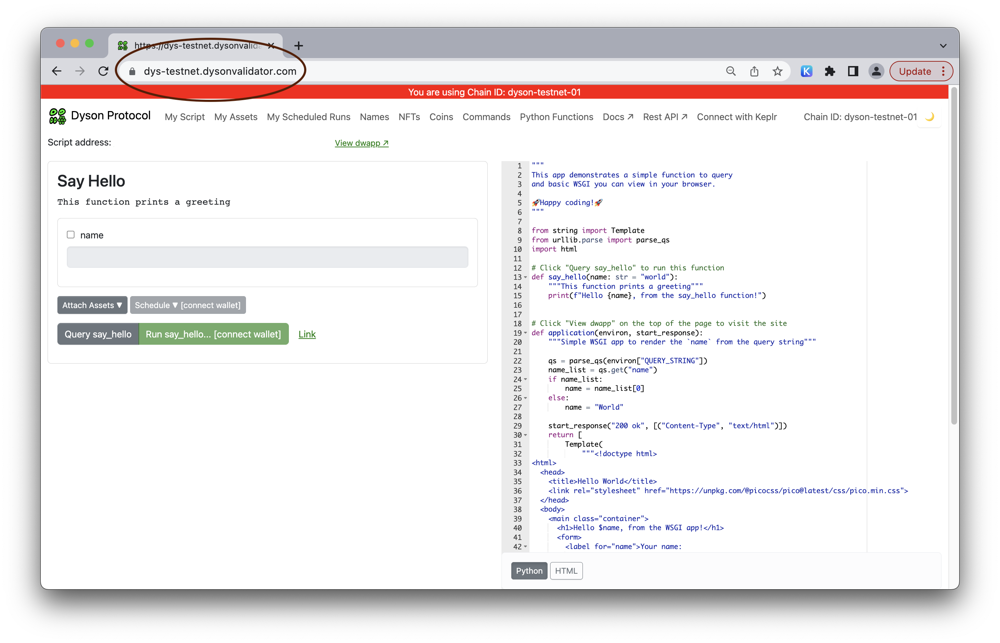
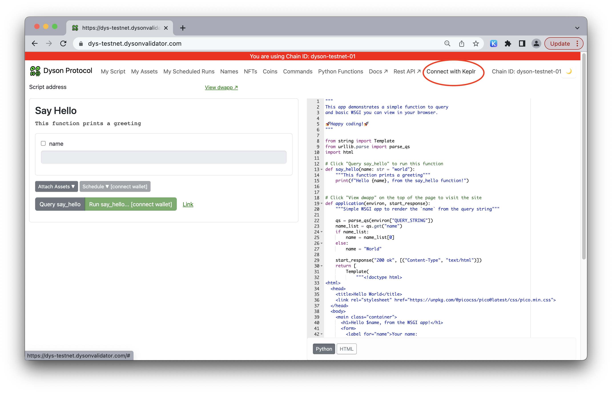
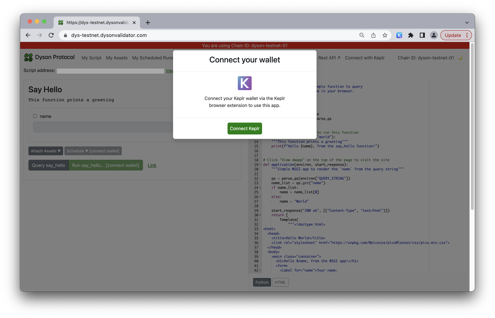
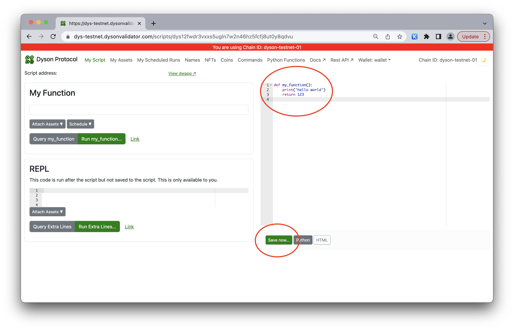
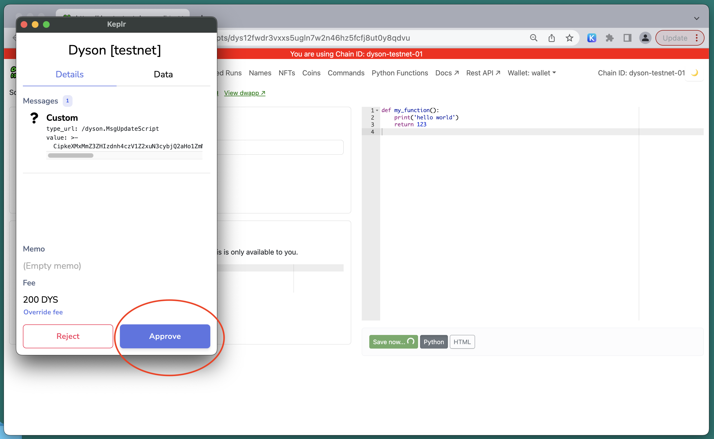
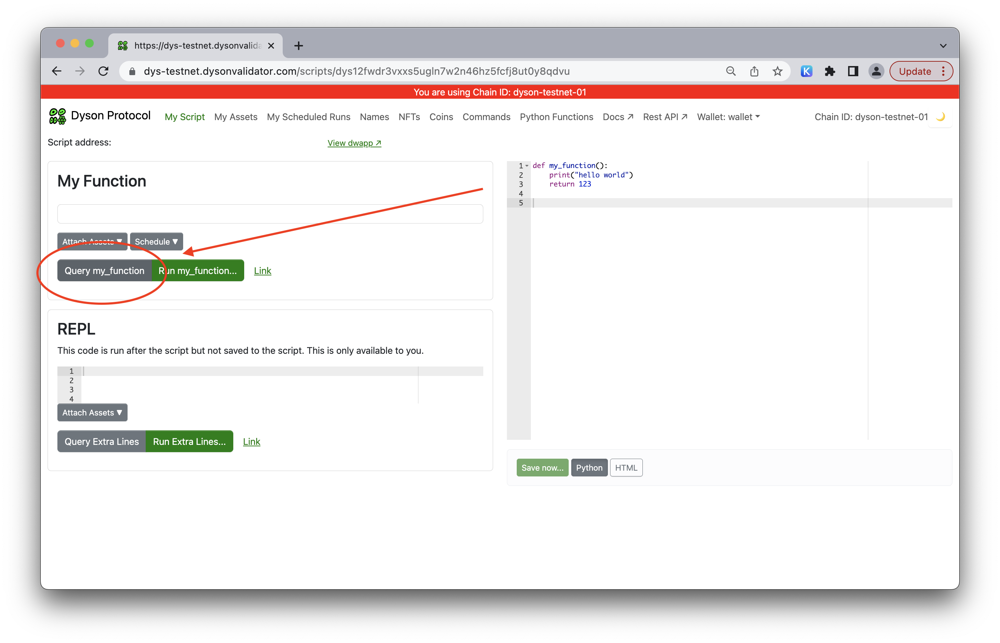
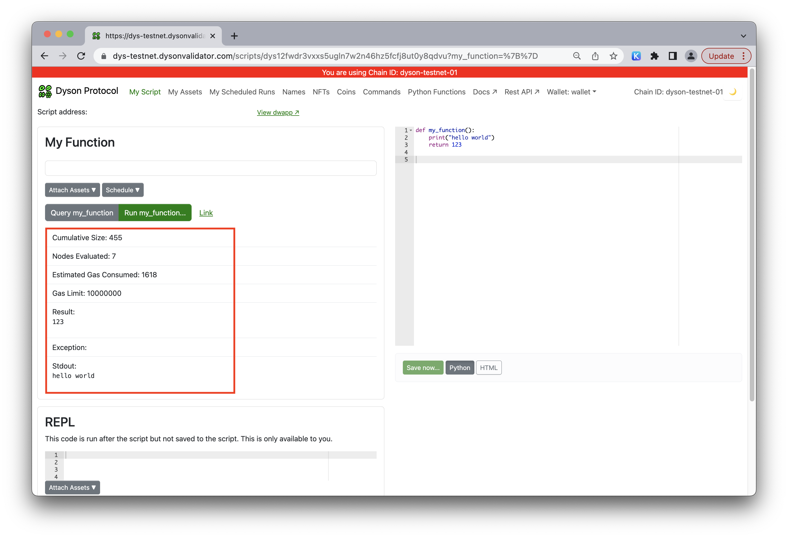
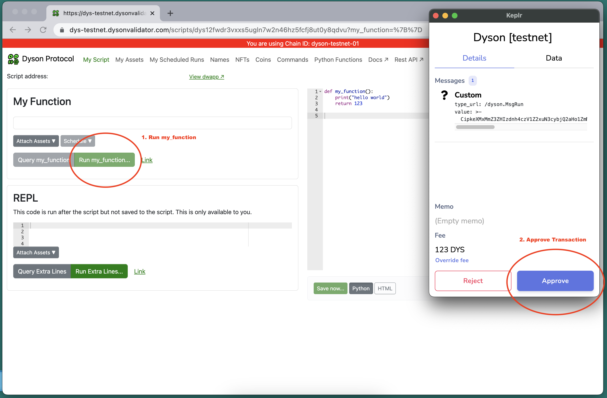
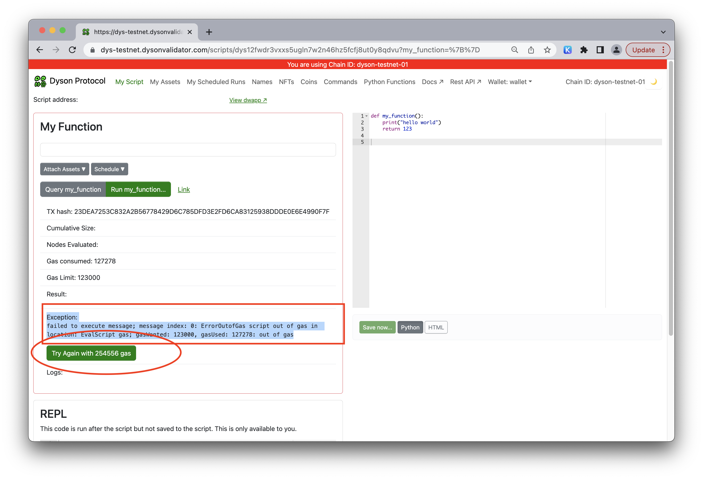
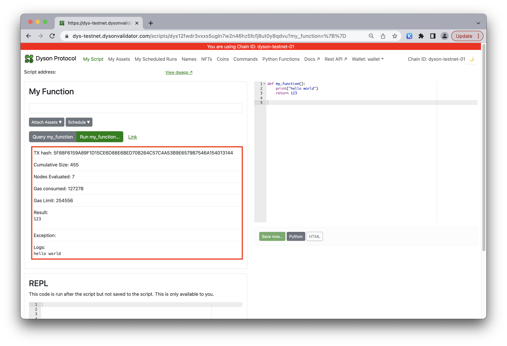

Welcome to another Dyson Protocol tutorial! If you've acquired some testnet DYS coins and are eager to put them to use, this guide will help you create your first basic Dyson Protocol function.

**Step 1: Navigate to https://dys-testnet.dysonvalidator.com/**

Kickstart your journey by visiting the Dyson Protocol website.



**Step 2: Unlock your wallet**

Click on "Connect with Keplr" and then "Connect Keplr" to access your wallet.




**Step 3: Verify your script address**

Click “My Script”  to view your script address. Ensure that it matches the address in your wallet.


**Step 4: Create a function**

In the editor, type out a simple function. Here's an example:

```
{
def my_function():
    print('hello world')
    return 123
}
```
This function prints "hello world" and returns the number 123 when invoked. Click "save" to proceed. 



**Step 5: Keplr wallet interaction**

Upon saving, your Keplr wallet will open. Here, you'll need to decide the gas amount for your function. The default value should suffice for this basic function. However, for larger or more intricate functions, consider increasing the gas amount. Click 'Approve' to move forward.



**Step 6: Query the function**

Press the 'Query my_function' button to test your function. In the Dyson Protocol, the 'QUERY' operation is equivalent to the "call" in Ethereum. It requests data from the chain without saving anything and costs no DYS.



**Step 7: Interpret the output**

The output will display the returned value (in this case, "123"), any raised exceptions, and the Standard Output (Stdout) or log, which shows the printed script ("hello world" for this example).



**Step 8: Run the function**

Click the “Run my_function” button to execute your function.



**Step 9: Adjust the gas amount**

Just like in step 5, your Keplr wallet will prompt you to determine the gas amount for running your function. Again, the default value should suffice for this simple function.


**Step 10: ErrorOutofGas**

If you receive an error showing

*“Exception: failed to execute message; message index: 0: ErrorOutofGas script out of gas in location: EvalScript gas; gasWanted: 123000, gasUsed: 127278: out of gas”*

Simply run the function again, the gas will automatically adjust. The button “Try Again” adjust the gas as well.




**Step 11: Review the output**

The output will be similar to that of the Query but will additionally include a transaction hash, indicating that the state has been saved on the Dyson Protocol  blockchain. As long as the result and Stdout match those from the Query, everything is in order.



Congratulations! You've successfully created, queried, and run your first function on the Dyson Protocol. Feel free to experiment with more complex functions now.
